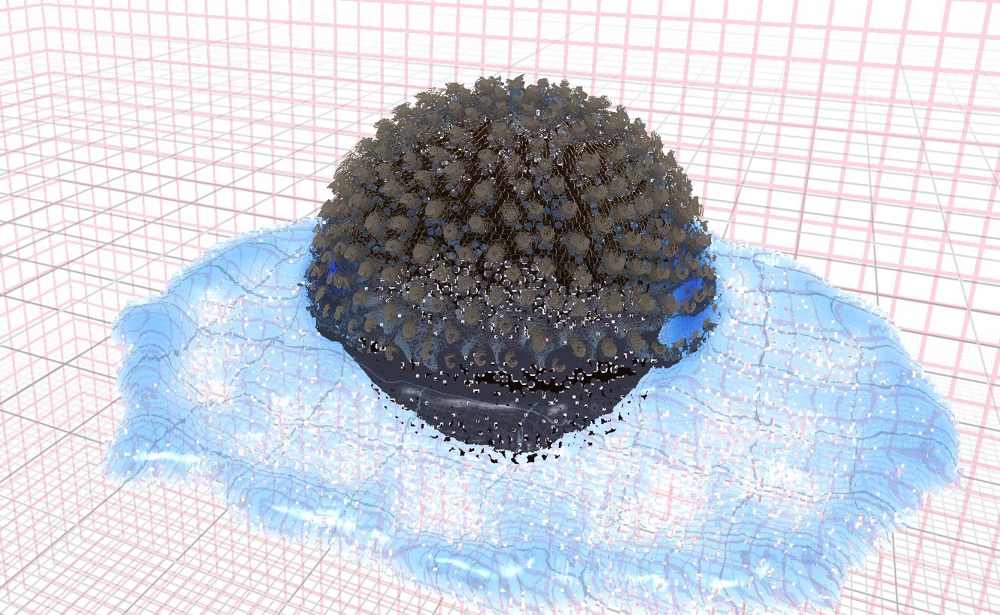

# Real-Time Wet Hair Simulation using Afro-Textured Hair
By Iris Onwa

This repository is the implementation of my thesis by the above name, submitted for my Master's thesis at Trinity College Dublin.

It features an implementation of 
- Position and Orientation Based Cosserat Rods by Kugelstadt and Schömer (2016),
- Position Based Fluids by Macklin and Müller (2013), and
- Coupling Hair with Smoothed Particle Hydrodynamics Fluids by Lin (2014)

It was submitted on April 18th, 2025. (Currently ungraded).

The code is implemented using OpenGL 4.6 and C++. GLFW was used for windowing and GLAD for headers. I also used Dear ImGui for the GUI.

The version of this repo that was submitted is available at <https://github.com/irisonwa/RealTimeWetHair/tree/b1c7393d38a897683c609c5c499475d405f57956>

repo will be cleaned up over time

## Simulation

Full video demonstration: <https://youtu.be/z68gn46AZ0U>

The simulation is run using compute shaders in [Shaders/sim/compute/](https://github.com/aloneInEntropy/RealTimeWetHair/tree/main/Shaders/sim). I used atomic bump allocation for creating a fixed grid and searching for nearby neighbours. 
